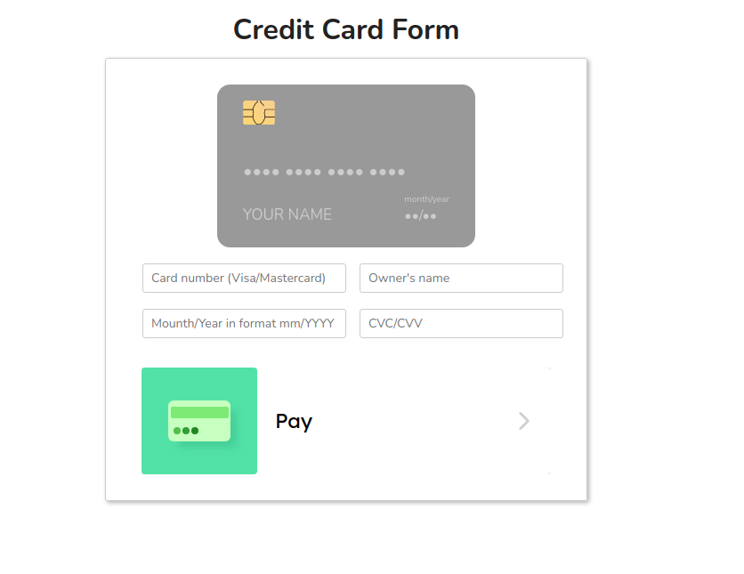

# Getting Started with Create React App

​
This project was bootstrapped with [Create React App](https://github.com/facebook/create-react-app).

## Available Scripts

In the project directory, you can run:

### `npm start`

Runs the app in the development mode.\
Open [http://localhost:3000](http://localhost:3000) to view it in the browser.

The page will reload if you make edits.\
You will also see any lint errors in the console.

## :hammer: Used technologies:

- React.JS + hooks
- Typescript

## :star: Implemented features

In the first layout credit card front facing showned. Users can type a valid credit card number in the input tag. A valid card number must contain 16 digits and starts with only 4 or 5.

Once typing is complete, there is be some icon on the top left corner for showing if the card number is
VISA or MASTERCARD.

VISA card number must be started with 4 and MASTERCARD must be started with 5.
In the second layout credit card back facing been shown. There is be one inputs for typing CCV. CCV must be 3 digits length. Date must be MM/YYYY format.
Users can switch between card faces by clicking on the input fields while keeping the current information.

After you all fill in the fields on the credit card, then a GET request is sent to https://mocki.io/v1/a5ae8585-b42d-486b-a4ff-25ebfebbaddf is here to check if the card number exists or not. If it exists, a message is displayed "Payment is a success", if not, then the message "Payment failed" is displayed
